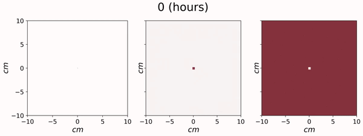

# funwalk

    A two-state system of diffusion models dimorphic fungal morphogenesis and mycelial growth
    
* All figure generation and modeling is available in [models.ipynb](https://github.com/cameronmartino/funwalk/blob/master/models.ipynb). 
* A full write up in LaTeX can be found [here](https://github.com/cameronmartino/funwalk/tree/master/ms).
